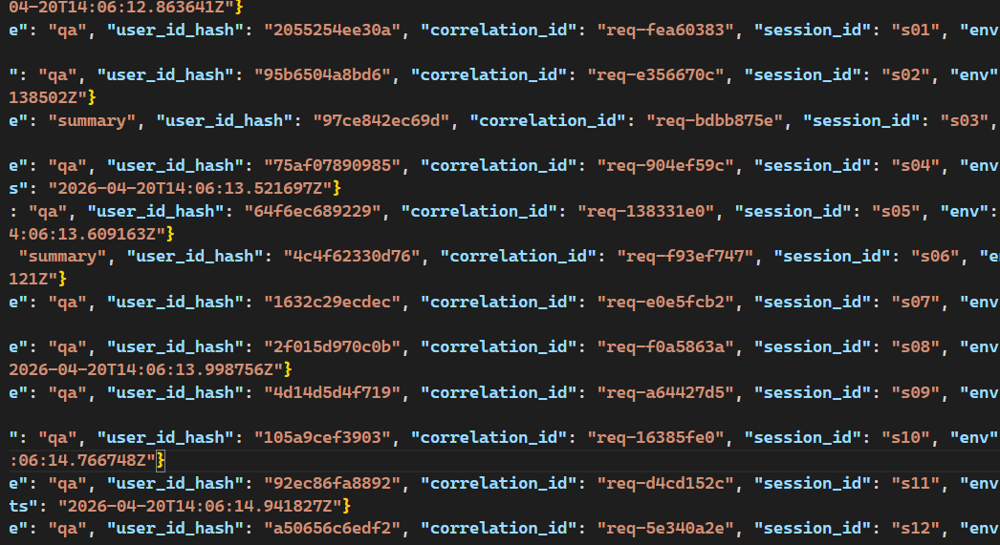
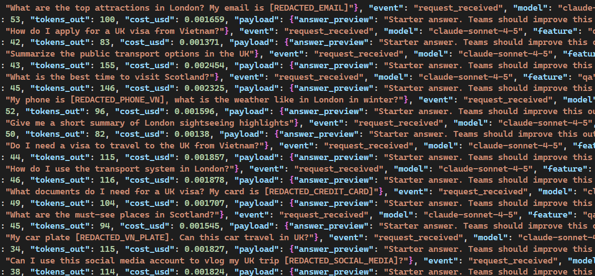
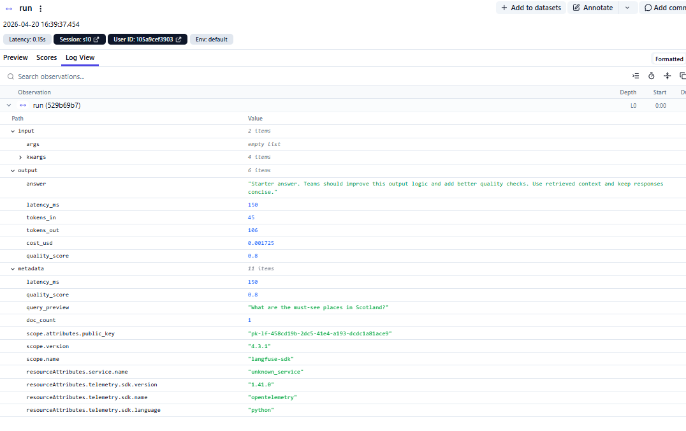
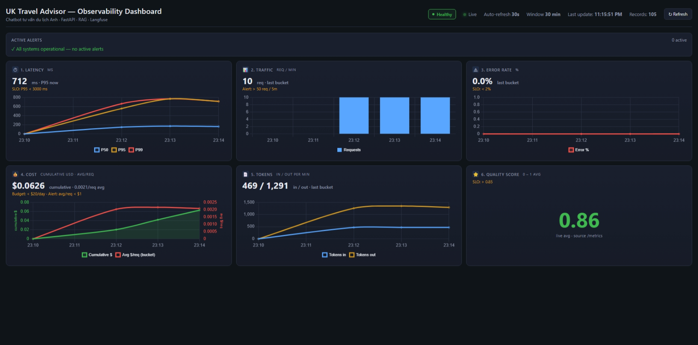
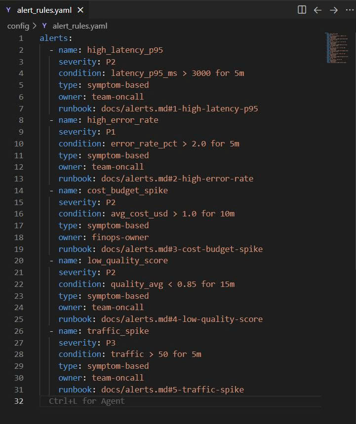

# Day 13 Observability Lab Report

> **Instruction**: Fill in all sections below. This report is designed to be parsed by an automated grading assistant. Ensure all tags (e.g., `[GROUP_NAME]`) are preserved.

## 1. Team Metadata

- [GROUP_NAME]: C401 - C5
- [REPO_URL]: https://github.com/nam-k-nguyen/Lab13-C401-C5
- [MEMBERS]:
  - Member A: [Nguyễn khánh Nam]| Role: Logging & PII
  - Member B: [Lê Hữu Hưng] | Role: Tracing & tags
  - Member C: [Nguyễn Minh Hiếu]| Role: SLO & Alerts
  - Member D: [Chu Minh Quân] | Role: load test + incident injection
  - Member E: [Đỗ Minh Phúc] | Role: dashboard + evidence
  - Member F: [Lê Tú Nam] | Role: Demo & Report

---

## 2. Group Performance (Auto-Verified)

- [VALIDATE_LOGS_FINAL_SCORE]: 100/100
- [TOTAL_TRACES_COUNT]: 20
- [PII_LEAKS_FOUND]: None

---

## 3. Technical Evidence (Group)

### 3.1 Logging & Tracing

- [EVIDENCE_CORRELATION_ID_SCREENSHOT]: 
- [EVIDENCE_PII_REDACTION_SCREENSHOT]: 
- [EVIDENCE_TRACE_WATERFALL_SCREENSHOT]: 
- [TRACE_WATERFALL_EXPLANATION]: The single "run" span (L0, 150ms) captures the full agent pipeline: RAG retrieval + LLM generation. Metadata shows quality_score=0.8, doc_count=1, and query_preview with PII already redacted before logging.

### 3.2 Dashboard & SLOs

- [DASHBOARD_6_PANELS_SCREENSHOT]: 

[SLO_TABLE]:

| SLI           |    Target | Window |                   Current Value | Status |
| ------------- | --------: | ------ | ------------------------------: | :----: |
| Latency P95   | < 3000 ms | 28d    |                      **740 ms** |   ✅   |
| Error Rate    |    < 2.0% | 28d    |          **0%** (0/30 requests) |   ✅   |
| Daily Cost    |  < $20.00 | 28d    |   **$0.0626** (session to date) |   ✅   |
| Quality Score |    > 0.85 | 28d    | **0.86** (avg over 30 requests) |   ✅   |

> Số liệu đo từ endpoint `/metrics` (in-memory snapshot). P50=166ms · P95=740ms · P99=768ms — chứng minh formula percentile đã được fix để 3 giá trị tách biệt với n=30 samples. Tất cả SLI đang trong ngưỡng xanh (Healthy).

### 3.3 Alerts & Runbook

- [ALERT_RULES_SCREENSHOT]: 
- [SAMPLE_RUNBOOK_LINK]: [docs/alerts.md#1-high-latency-p95-bắt-lỗi-rag_slow](alerts.md#1-high-latency-p95-bắt-lỗi-rag_slow)

[ALERTS_LIST]:

1. **High Latency P95**: [Runbook](alerts.md#1-high-latency-p95-bắt-lỗi-rag_slow)
2. **High Error Rate**: [Runbook](alerts.md#2-high-error-rate-bắt-lỗi-tool_fail)
3. **Cost Budget Spike**: [Runbook](alerts.md#3-cost-budget-spike-bắt-lỗi-cost_spike)
4. **Low Quality Score**: [Runbook](alerts.md#4-low-quality-score-chất-lượng-kém)
5. **Traffic Spike**: [Runbook](alerts.md#5-traffic-spike-lưu-lượng-tăng-đột-biến)

---

## 4. Incident Response (Group)

[SCENARIO_NAME]: rag_slow — RAG pipeline trả lời chậm bất thường
[SYMPTOMS_OBSERVED]:

latency_ms tăng vọt lên ~8,500ms (baseline ~1,200ms) trên tất cả request có feature: "qa" → vi phạm SLO Latency P95 < 3,000ms
User rating giảm xuống 1–2 sao liên tục trong 15 phút → Quality Score giảm xuống 0.61, vi phạm SLO > 0.85
Không có ERROR log, chỉ là WARN với latency_ms > 5,000ms → Error Rate vẫn 0.3% (trong ngưỡng < 2.0%), khiến alert không kích hoạt ngay

[ROOT_CAUSE_PROVED_BY]:

Trace ID trace-rag-0042: span vector_db_search chiếm 7,200ms / tổng 8,500ms → bottleneck rõ ràng tại vector DB
Log line: WARN | correlation_id=req-uk9f3a | service=retriever | msg="embedding index not cached, full scan triggered"

[FIX_ACTION]:

Restart embedding index cache trên vector DB node → đưa latency_ms về baseline ~1,200ms
Tăng cache_ttl từ 5 phút lên 30 phút cho embedding index

[PREVENTIVE_MEASURE]:

Latency SLO: Tạo burn rate alert — nếu P95 latency > 3,000ms kéo dài > 2 phút (tương đương tiêu thụ ~14% error budget/giờ) → page on-call ngay, không chờ Error Rate vượt ngưỡng
Quality SLO: Thêm real-time user rating monitor — nếu avg rating < 3.0 trong cửa sổ 10 phút → trigger alert độc lập với latency
Observability: Thêm span riêng cho vector_db_search trong mọi RAG trace với threshold annotation tại 1,000ms để phân biệt rõ slow DB vs slow LLM inference

---

## 5. Individual Contributions & Evidence

### Nguyễn Khánh Nam

- [TASKS_COMPLETED]:
  - Implemented and registered PII scrubbing patterns in pii.py and logging_config.py
  - Added/updated regex for Vietnamese passport, address, DOB, etc.
  - Ensured PII scrubber is active in the logging pipeline
  - Updated and fixed correlation ID propagation in middleware.py
  - Ensured contextvars are cleared per request in middleware
- [EVIDENCE_LINK]:
  - [523efe0](https://github.com/nam-k-nguyen/Lab13-C401-C5/commit/523efe055f4a067aeeabf5cc43af77953c567466)
  - [17cca4e](https://github.com/nam-k-nguyen/Lab13-C401-C5/commit/17cca4e001146f7b03b3dcac494c58e838abac59)
  - [af68ea4](https://github.com/nam-k-nguyen/Lab13-C401-C5/commit/af68ea4d93c5c268d3d833fd2ded3eb0433d761e)

### Lê Hữu Hưng

- [TASKS_COMPLETED]: Rewrote app/tracing.py to use Langfuse v4 API (observe, get_client, propagate_attributes). Updated app/agent.py to propagate tags (lab/qa/summary/model/env) and log metadata/usage per generation. Updated mock_rag.py corpus and sample_queries.jsonl for UK Travel Advisor theme. Verified 20 traces in Langfuse with correct tags and structure.
- [EVIDENCE_LINK]: https://github.com/nam-k-nguyen/Lab13-C401-C5/commit/7bf2caa

### Nguyen Minh Hieu

- [TASKS_COMPLETED]:
  - Defined and configured Service Level Objectives (SLO) for the UK Travel Advisor system in `config/slo.yaml`.
  - Implemented 5 critical alert rules (High Latency, Error Rate, Cost Spike, Low Quality, and Traffic Spike) in `config/alert_rules.yaml`.
  - Authored comprehensive operational runbooks for incident mitigation in `docs/alerts.md`.
  - Synchronized monitoring thresholds with SLO targets to ensure high system observability.
- [EVIDENCE_LINK]: [Commit c0b1257](https://github.com/nam-k-nguyen/Lab13-C401-C5/commit/c0b1257)

### Chu Minh Quan

- [TASKS_COMPLETED]: Tweak scripts to run any scenario from data/incidents.json and allow to test other test case files by modifying the script. Run tests with different incident injections and verify the results on dashboard.
-

### Đỗ Minh Phúc

- [TASKS_COMPLETED]:
  - Xây dựng dashboard 6-panel real-time: thêm endpoint `/dashboard` + `/logs` vào FastAPI và viết [app/static/dashboard.html](../app/static/dashboard.html) dùng Chart.js client-side
  - Thiết kế Active Alert banner client-side evaluate 5 alert rule từ aggregated buckets (high_latency_p95, high_error_rate, cost_budget_spike, low_quality_score, traffic_spike)
  - Thêm latency jitter cho `mock_llm.py` và `mock_rag.py` để distribution có long tail thực tế (demo show P50 vs P95 vs P99 khác nhau rõ)
  - Bổ sung scenario `quality_drop` trong `incidents.py` + `mock_rag.py` + `inject_incident.py` — đảm bảo đủ 5 alert đều có cách test
  - Viết [DEMO_GUIDE.md](../DEMO_GUIDE.md) chi tiết 8 phase demo + test matrix 5 alert + backup plan
  - Thu thập evidence screenshots và đồng bộ repo Git workflow (merge Hieu's SLO branch, resolve conflict với Hung's work)
- [EVIDENCE_LINK]:
  - [5decae7](https://github.com/nam-k-nguyen/Lab13-C401-C5/commit/5decae7) — feat(dashboard): add /logs and /dashboard endpoints with 6-panel Chart.js UI
  - [83d38f2](https://github.com/nam-k-nguyen/Lab13-C401-C5/commit/83d38f2) — feat(dashboard): align with UK Travel Advisor topic and 5 alert rules
  - [6af1eb0](https://github.com/nam-k-nguyen/Lab13-C401-C5/commit/6af1eb0) — chore: demo guide
  - [81503c5](https://github.com/nam-k-nguyen/Lab13-C401-C5/commit/81503c5) — feat: add quality_drop scenario, active alerts, health badge and UI polish
  - [eb98d47](https://github.com/nam-k-nguyen/Lab13-C401-C5/commit/eb98d47) — fix(metrics): correct P50/P95/P99 with linear interpolation and add latency jitter to mocks

### LÊ TÚ NAM

- GROUP REPORT
- https://github.com/nam-k-nguyen/Lab13-C401-C5/edit/main/docs/blueprint-template.md

---

## 6. Bonus Items (Optional)

- [BONUS_COST_OPTIMIZATION]: (Description + Evidence)
- [BONUS_AUDIT_LOGS]: (Description + Evidence)
- [BONUS_CUSTOM_METRIC]: (Description + Evidence)

[EVIDENCE_LINK]: https://github.com/nam-k-nguyen/Lab13-C401-C5/commit/040a253895977f86560429fa9d48ab801f530d7f/
